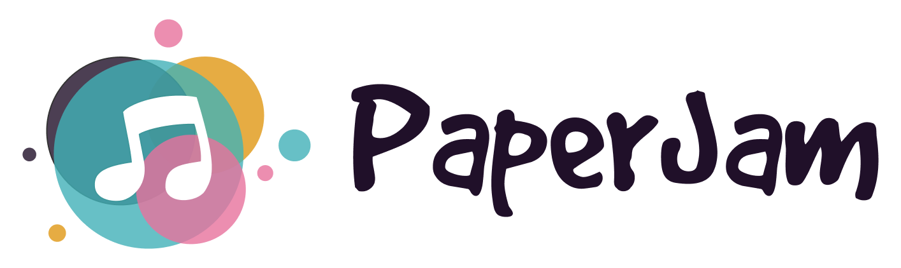

<p align="center">
  <a href="https://paperjam.henaff.io">
    
  </a>
</p>

# PaperJam

PaperJam is demo of an e-commerce site developed with Jamstack.  It is developed with Gatsby, DatoCMS and Snipcart. 
Visit the demo site [here](https://paperjam.henaff.io)

## 🌱 Prerequisites

* node >= 14

## 🚀 Quick start

```shell
yarn 

yarn develop 
```

Add your environnement file `.env.developemnt`
```
GATSBY_DATO_CMS_API_TOKEN=
GATSBY_SNIPCART_APIKEY=

```

Your site is now running at `http://localhost:8000`!

    _Note: You'll also see a second link: _`http://localhost:8000/___graphql`_. This is a tool you can use to experiment with querying your data. Learn more about using this tool in the [Gatsby tutorial](https://www.gatsbyjs.org/tutorial/part-five/#introducing-graphiql)._
